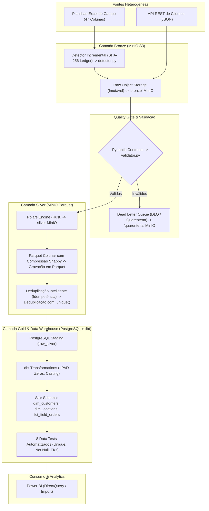

# DataForge: Plataforma de Engenharia de Dados & Data Lakehouse Medallion

        

# Visão geral do Projeto:

O DataForge é uma plataforma moderna de Engenharia de Dados orientada à Arquitetura Medalhão (Bronze, Silver e Gold), é projetada para resolver desafios reais de ingestão, validação de qualidade, governança e modelagem analítica para operações de campo.

A plataforma processa dados heterogêneos, nesse caso é simulado de Excel e API, porém a plataforma foi desenvolvida para ser aplicado em uma situação real (dados confidenciais). O projeto faz ingestão incremental, quarentena de registros inválidos (DLQ), compressão colunar Parquet e modelagem dimensional em Star Schema (Kimball) para consumo analítico no Power BI.

## Arquitetura da Solução:



## Decisões de Engenharia & Trade-offs (ADRs)

| Componente            | Decisão Técnica             | Motivo & Benefício de Negócio                                                                         |
| :-------------------- | :-------------------------- | :---------------------------------------------------------------------------------------------------- |
| **Object Storage**    | **MinIO (S3 API)**          | Compatibilidade nativa 1:1 com AWS S3, permitindo deploy em nuvem sem alterar uma linha de código.    |
| **Data Lake Format**  | **Apache Parquet + Snappy** | Redução de ~80% no armazenamento em relação ao Excel original e leitura colunar ultra rápida.         |
| **Quality Gate**      | **Pydantic + DLQ**          | Isolamento automático de faturas e dados corrompidos para quarentena sem interromper a esteira.       |
| **Processing Engine** | **Polars (Rust)**           | Velocidade de execução em memória com baixo consumo de RAM para grandes volumes.                      |
| **Data Warehouse**    | **PostgreSQL 15**           | Armazenamento relacional analítico robusto com suporte a conexões de BI.                              |
| **Transformation**    | **dbt (Data Build Tool)**   | Linhagem de dados, regras de negócio em SQL modular e 8 testes de qualidade automatizados.            |
| **Idempotência**      | **TRUNCATE + Append**       | Capacidade de reprocessar o pipeline 100x sem duplicar linhas e sem quebrar Views dependentes do dbt. |
| **Observabilidade**   | **Structured JSON Logging** | Logs padronizados com `execution_id`, `timestamp` UTC e `level` para observabilidade de nuvem.        |
| **CI/CD**             | **GitHub Actions + PyTest** | Esteira automática rodando linters (Ruff) e testes unitários a cada `git push`.                       |

## Como executar localmente

### 1. Pré-requisitos

- Docker & Docker Compose instalado.
- Python 3.11+ e Poetry instalados.

### 2. Subir a infra (MinIO + PostgreSQL)

```bash
docker compose up -d
```

- Painel MinIO: http://localhost:9001 (user: minioadmin | pass: minioadmin)
- PostgreSQL: localhost:5433 (DB: dataforge_dw | user: postgres | pass: postgrespassword)

### 3. Instalar dependências

```bash
poetry install
```

### 4. Executar o Pipeline Master de Ponta a Ponta

```bash
python src/dataforge/pipeline.py
```

### 5. Executar os Testes Automatizados

```bash
poetry run pytest -v
```

## Estrutura do Projeto

```text
projeto-dataforge/
    ├── .github/workflows/ci.yml       # Esteira de CI/CD no GitHub Actions
    ├── dbt_dataforge/                 # Projeto dbt com Modelagem Dimensional
    │   ├── models/
    │   │   ├── staging/               # Views de limpeza e formatação (stg_field_orders, stg_customers)
    │   │   ├── marts/                 # Star Schema Gold (dim_customers, dim_locations, fct_field_orders)
    │   │   └── schema.yml             # 8 Testes automatizados do dbt
    │   ├── dbt_project.yml
    │   └── profiles.yml
    ├── src/dataforge/                 # Código-fonte da Plataforma
    │   ├── extraction/                # Ingestão, Hashing SHA-256 e API Extractor
    │   ├── quality/                   # Contratos Pydantic e Validador DLQ
    │   ├── storage/                   # Conectores S3/MinIO, Silver Parquet e Postgres Loader
    │   ├── utils/                     # Structured Logger e Path Resolvers
    │   └── pipeline.py                # Orquestrador Master End-to-End
    ├── tests/                         # Suíte de Testes Automatizados com PyTest
    ├── docker-compose.yml             # Infraestrutura como Código (MinIO + Postgres)
    ├── pyproject.toml                 # Gerenciamento de Dependências (Poetry)
```

## Autor do Projeto

Guilherme Miguel

- Github: [@guilherme-miguel9](https://github.com/guilherme-miguel9)
